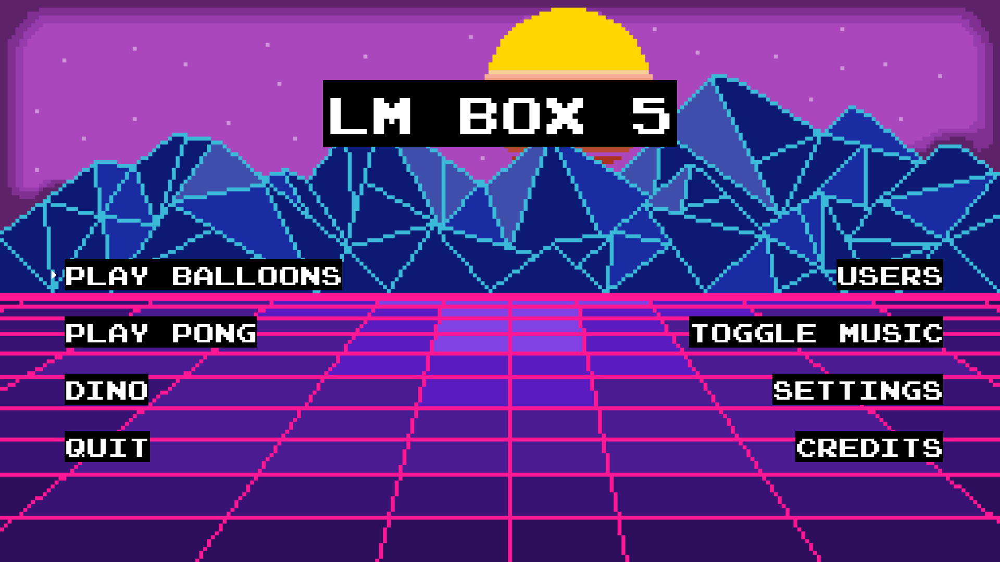
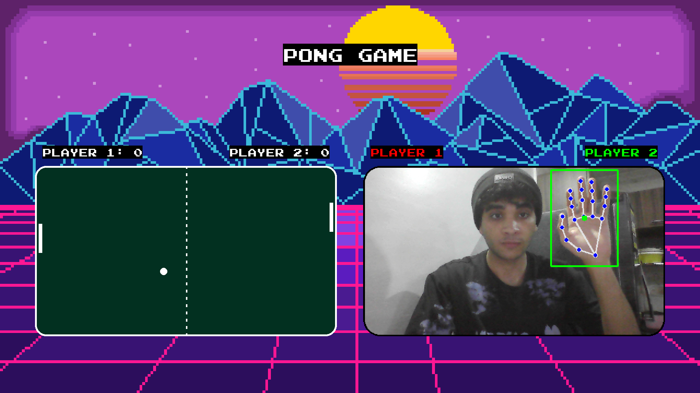
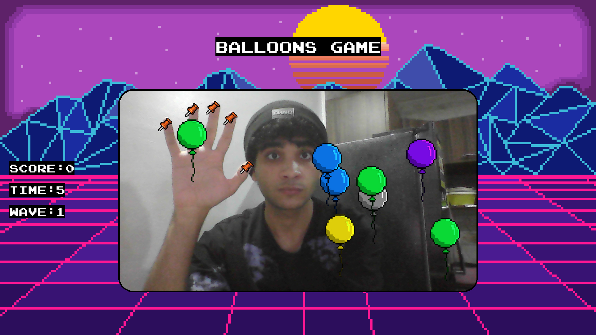
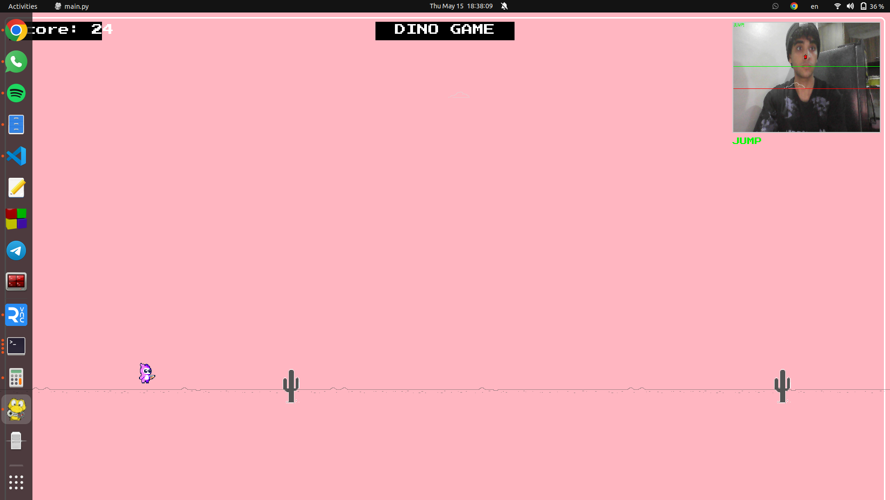
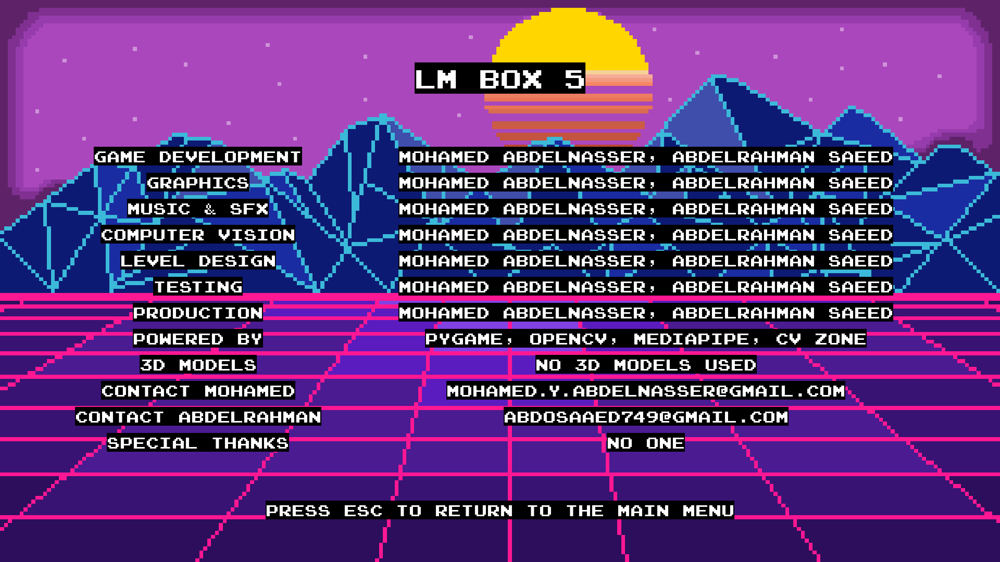
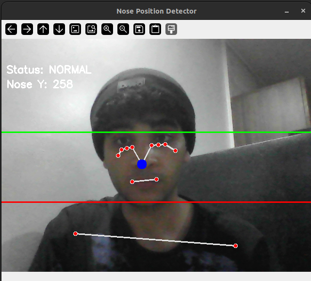

# LM Box 5

## Classic Games Powered by Computer Vision

### Overview

LM Box 5 is a retro gaming project that replaces traditional controllers with computer vision. Players can compete in three classic games:

-   **Balloons**: Use finger movements to pop balloons before they vanish.
-   **Pong**: Control paddles via hand tracking to bounce a ball back and forth.
-   **Dinosaur Runner**: Jump and duck using body movements to avoid obstacles.

The project leverages real-time hand and body tracking using computer vision modules for an intuitive gaming experience.

## Features

-   **Hand Tracking**: Utilizes the Mediapipe Hands module for accurate finger detection and gesture recognition.
-   **Body Pose Detection**: Uses Mediapipe Pose to track body movements for jumping and ducking.
-   **Interactive UI**: A sleek interface for game selection and settings.
-   **Real-Time Performance**: Ensures responsive gameplay with minimal lag.
-   **Customizable Settings**: Adjustable difficulty, sound levels, and display options.

## Games Included

1. **Balloons**: Pop colorful balloons using finger movements before they float away.
2. **Pong**: Classic two-player paddle game controlled by hand tracking.
3. **Dinosaur Runner**: A T-Rex runner clone controlled by body movements.
   - Jump over cacti and dodge pterodactyls by moving your body
   - Enhanced with a pink background for better visualization
   - Enlarged characters and obstacles for improved gameplay
   - Camera overlay showing your body position in real-time

## Installation

### Prerequisites

Ensure you have Python 3.8 or later installed.

### Setup

1. Clone the repository:
    ```sh
    git clone https://github.com/Samspei01/LM_BOX_5.git
    cd LM_BOX_5
    ```
2. Install dependencies:
    ```sh
    pip install -r requirements.txt
    ```
3. Run the application:
    ```sh
    python main.py
    ```

## Controls

- **Balloons & Pong Games:**
  - Control using hand movements detected by the camera
  - Hand tracking provides intuitive control of game elements

- **Dinosaur Game:**
  - **Camera Controls:** Position yourself in front of the camera
    - Move your head up to jump over cacti
    - Move your head down to duck under pterodactyls
  
  - **Keyboard Fallback:** If camera controls aren't working
    - Space/Up Arrow: Jump
    - Down Arrow: Duck
    - ESC: Return to menu

## Technical Requirements

- Python 3.8 or higher
- Pygame and Pygame_menu
- OpenCV (cv2)
- Mediapipe
- CVZone (for hand detection)
- NumPy
- Screen resolution of 1280x720 or higher recommended

## Dependencies

Key libraries used in this project:

```
- OpenCV (opencv-python)
- NumPy
- PyGame
- PyGame_menu
- cvzone
- Mediapipe
- SQLite3
```

For the full list, see [requirements.txt](requirements.txt).

## Methodology

LM Box 5 uses the following computer vision technologies:

1. **Mediapipe Hands** module: A high-fidelity hand and finger tracking solution that employs machine learning to infer 21 3D landmarks of a hand from just a single frame. This powers the Balloons and Pong games.

2. **Mediapipe Pose** module: Used in the Dinosaur game to track body position and movements, enabling jump and duck controls.

### How It Works:

-   **Hand Detection**: Identifies hands in real-time video streams.
-   **Landmark Inference**: Infers 21 3D landmarks per hand, including finger tips, joints, and palm points.
-   **Gesture Mapping**: Translates finger positions and gestures into game controls.
-   **Pose Detection**: Identifies key body landmarks to determine player position and movements.


### Application in LM Box 5:

-   In **Balloons**, finger movements are tracked to pop on-screen balloons.
-   In **Pong**, hand gestures control players' paddle movement.
-   In **Dinosaur Runner**, body pose detection enables jumping and ducking movements.

## File Structure

```
lm-box-5/
├─ gui/
│   ├─ design/
│   ├─ resources/
│   │   ├─ fonts/
│   │   ├─ images/
│   │   └─ sounds/
│   ├─ __init__.py
│   ├─ gui.py
│   ├─ dino_game.py
│   └─ utils.py
├─ models/
│   ├─ __init__.py
│   ├─ cvzone_hand_detection.py
│   ├─ mediapipe_hand_tracking.py
│   └─ requirements.txt
├─ dinosaur_game_main/
│   ├─ __init__.py
│   ├─ main.py
│   ├─ race.py
│   └─ assets/
│       ├─ cacti/
│       ├─ sfx/
│       └─ various sprite images
├─ utils/
│   └─ save_image.py
├─ requirements.txt
├─ README.md
└─ main.py
```

## Credits

- Built with Pygame and Mediapipe
- Font: Press Start 2P, Joystix Monospace
- Sound effects: Creative Commons licensed

### Contact

For questions or support, you can reach out to the project maintainers:
- Abdelrhman Saeed: [abdosaaed749@gmail.com](mailto:abdosaaed749@gmail.com)
- Mohamed Yousef: [Mohamed.y.abdelnasser@gmail.com](mailto:Mohamed.y.abdelnasser@gmail.com) | [GitLab Profile](https://gitlab.com/Momad-Y)

## Screenshots

Here are some screenshots showcasing the different games and features of LM Box 5:


*Main menu interface with game selection options*


*Balloons game with colorful balloons to pop using hand gestures*


*Classic Pong game controlled via hand tracking*


*Dinosaur runner game with pose detection controls*


*Hand tracking visualization showing landmark detection*


*Settings interface for customizing game parameters*


*Action gameplay showing computer vision integration*

## References

-   [PyGame Documentation](https://www.pygame.org/docs/)
-   [Mediapipe Hands Documentation](https://mediapipe.readthedocs.io/en/latest/solutions/hands.html)
-   [Mediapipe Pose Documentation](https://mediapipe.readthedocs.io/en/latest/solutions/pose.html)
-   [cvzone Repository](https://github.com/cvzone/cvzone)

## License

This project is licensed under the MIT License.

## Contributing

Contributions are welcome! Please feel free to submit a Pull Request.
